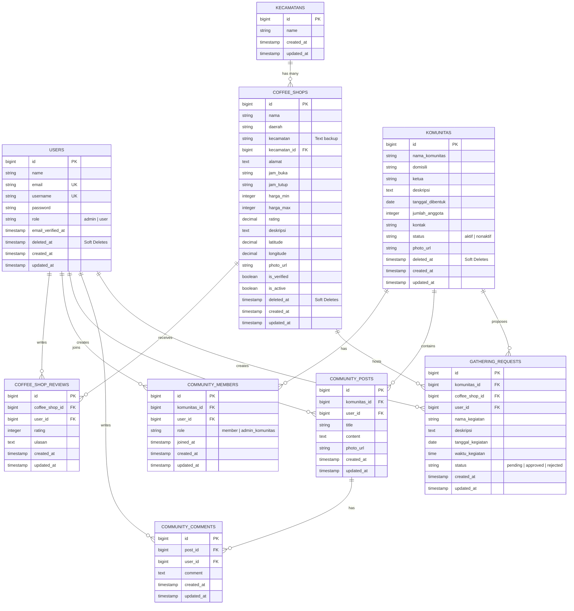

# 📊 Entity Relationship Diagram (ERD) - Daily Coffee

Dokumen ini berisi visualisasi dan spesifikasi hubungan antar-tabel (*Entity Relationship Diagram*) untuk sistem database **Daily Coffee Sidoarjo** menggunakan format Mermaid.

---

## 📝 Penjelasan Hubungan Relasi (Relationships)

1.  **Kecamatan & Coffee Shop (`One-to-Many`)**
    *   Satu `KECAMATAN` dapat menampung banyak `COFFEE_SHOP`.
    *   Kunci Relasi: `kecamtan_id` di tabel `coffee_shops`.

2.  **User & Coffee Shop Reviews (`Many-to-Many via Review`)**
    *   Satu `USER` dapat menulis banyak `COFFEE_SHOP_REVIEWS`.
    *   Satu `COFFEE_SHOP` dapat menerima banyak `COFFEE_SHOP_REVIEWS` dari pengguna yang berbeda.

3.  **User & Komunitas (`Many-to-Many via Member`)**
    *   Satu `USER` dapat bergabung ke banyak `KOMUNITAS` sebagai anggota (`COMMUNITY_MEMBERS`).
    *   Satu `KOMUNITAS` dapat diisi oleh banyak anggota (`COMMUNITY_MEMBERS`).

4.  **Komunitas, User & Post/Comments (`Hierarchical Relations`)**
    *   User memposting thread (`COMMUNITY_POSTS`) di dalam suatu `KOMUNITAS`.
    *   Postingan tersebut dapat dikomentari (`COMMUNITY_COMMENTS`) oleh user lain.

5.  **Gathering Requests (`Three-Way Relation`)**
    *   Pengajuan kumpul bareng/kegiatan diajukan oleh seorang `USER` yang mewakili `KOMUNITAS` tertentu, dengan memilih lokasi di salah satu `COFFEE_SHOP`.
