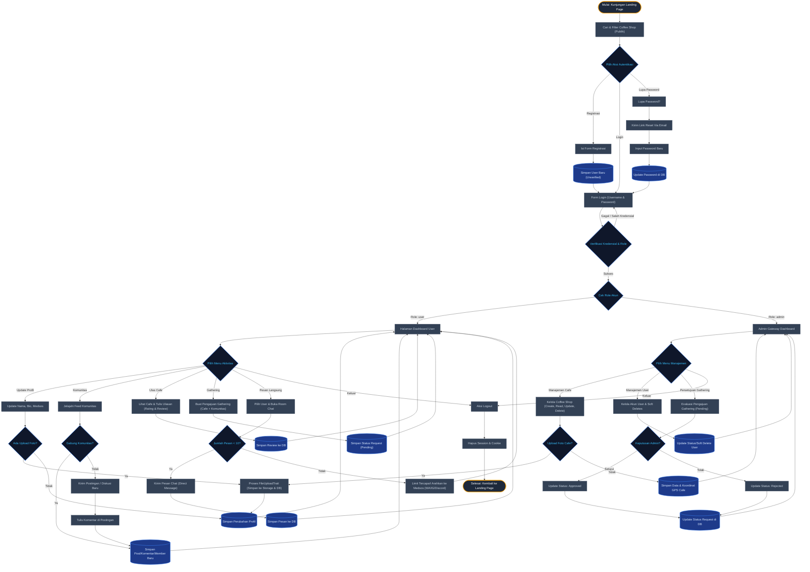

# 🔄 System Flowchart - Daily Coffee Sidoarjo

Dokumen ini berisi visualisasi alur sistem (flowchart) lengkap untuk **Daily Coffee Sidoarjo**. Semua alur terhubung secara utuh dari awal kunjungan hingga aksi akhir tanpa ada garis yang terputus.

## 🎨 Diagram Flowchart Sistem (Mermaid)

---

## 📝 Penjelasan Detail Alur

1. **Alur Autentikasi & Registrasi**:
   - Pengunjung umum (*guest*) dapat mencari cafe tanpa login. Jika memilih login/registrasi, sistem akan memvalidasi data dan mengarahkan ke dashboard yang sesuai berdasarkan **Role** (`user` atau `admin`).
   - Fitur **Lupa Password** menyediakan pengiriman token reset via email untuk memperbarui kata sandi secara aman.

2. **Aktivitas User Dashboard**:
   - **Update Profil**: Menggunakan `FileUploadTrait` untuk pemrosesan foto profil baru, lalu menyimpan data medsos terupdate.
   - **Komunitas & Diskusi**: Pengguna dapat menjelajahi feed komunitas, bergabung menjadi member, memosting thread diskusi baru, dan mengomentari postingan anggota lain.
   - **Ulasan Cafe**: Pengguna dapat melihat daftar cafe terdekat dan memberikan rating serta komentar ulasan.
   - **Direct Messages**: Chat personal antar pengguna dibatasi **maksimal 10 pesan**. Jika terlampaui, user akan diarahkan untuk melanjutkan komunikasi lewat kontak medsos yang tertera di profil.
   - **Gathering Request**: Pengguna dapat mengajukan kegiatan kumpul komunitas di kedai kopi tertentu. Pengajuan berstatus *pending* akan diverifikasi oleh Admin.

3. **Aktivitas Admin Panel**:
   - Admin berwenang mengelola data Coffee Shop (termasuk upload gambar, input titik koordinat GPS), mengelola akun pengguna (dengan fitur *soft delete*), serta memberikan persetujuan (*Approve*) atau penolakan (*Reject*) terhadap pengajuan gathering dari komunitas.

4. **Sesi Logout**:
   - Baik pengguna maupun admin dapat keluar dari sesi secara bersih, yang akan menghapus session cookie aktif dan mengembalikan ke Landing Page publik.
